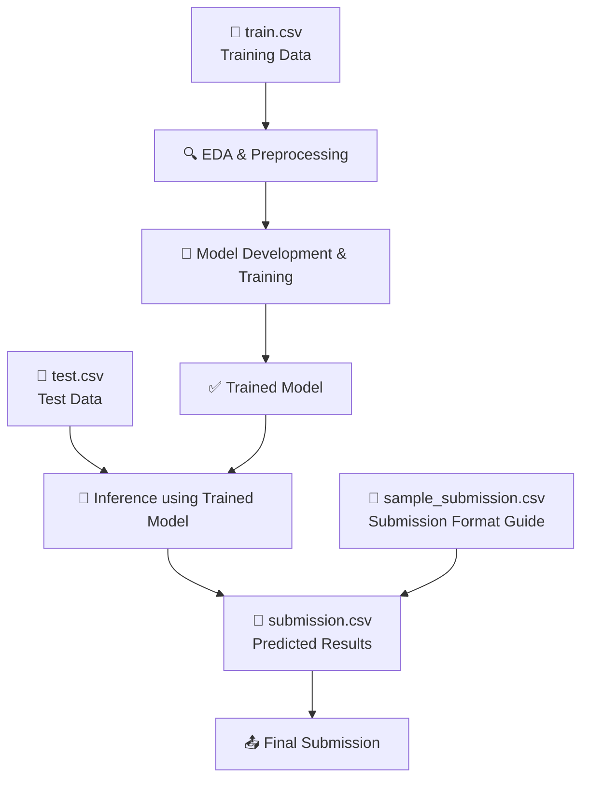
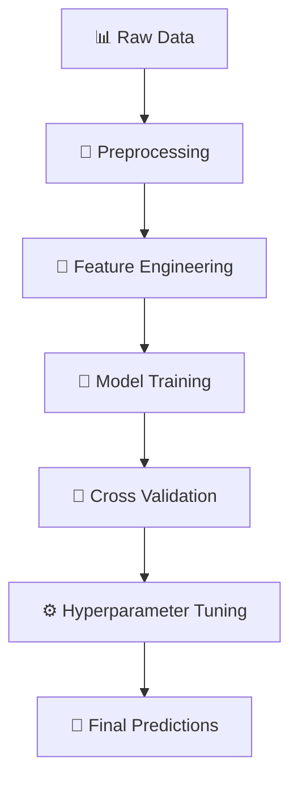

## 🔗 Competition Details

<div align="center">

### 📍 **Event Information**

[](https://www.hackerearth.com/challenges/new/competitive/shellai-hackathon-2025/)
[](https://www.shell.com/what-we-do/digitalisation/collaboration-and-open-innovation/shell-ai-hackathon-for-sustainable-and-affordable-energy.html)

</div>

| **Attribute** | **Details** |
|---------------|-------------|
| **🏢 Organizer** | Shell.ai Team |
| **🌐 Platform** | [HackerEarth](https://www.hackerearth.com/challenges/new/competitive/shellai-hackathon-2025/) |
| **📅 Competition Period** | Jul 04, 2025 - Jul 23, 2025 |
| **👥 Total Participants** | 7,005 |
| **🎯 Challenge Focus** | Sustainable Fuel Blend Properties Prediction |
| **📊 Submission Limit** | 2000 total, 100 per day |
| **🏆 Prize Categories** | General, University, Start-up Editions |

---

### 🛠️ **Tech Stack**

<div align="center">


</div>

*Special appreciation for the open-source data science ecosystem that made this project possible*

---
## 🌍 Introduction
Welcome to the sixth edition of the Shell.ai Hackathon for Sustainable and Affordable Energy. Shell.ai Hackathon brings together brilliant minds passionate about digital solutions and AI, to tackle real energy challenges and help build a lower-carbon world where everyone can access and afford energy.

## 🚀 Challenge

> *"Accelerating the transition to a net-zero future without compromising on excellence"*

The global call for sustainability is reshaping every industry, including mobility, shipping and aviation. Sustainable Aviation Fuels (SAFs) are pivotal in this transformation, offering a powerful lever to significantly reduce the sector's environmental footprint. However, integrating these innovative fuels into the existing ecosystem presents a sophisticated challenge.

Crafting the optimal fuel blend – mixing various sustainable fuel types sourced from diverse pathways with each other or with conventional fuels – is an intricate science. It demands a delicate balancing act: ensuring adherence to rigorous safety and performance specifications while maximizing environmental benefits and maintaining economic viability.


## 🎯 Problem Statement
In the fuel industry, blending different fuel components to achieve desired properties is both an art and a science. The relationships between component fractions and final blend properties are highly complex, involving linear and non-linear interactions, synergistic effects, and conditional behaviours that vary based on component combinations. This complexity makes accurate prediction a challenging, high-dimensional problem.

The challenge is to develop models capable of accurately predicting the properties of fuel blends based on their constituent components and their proportions. These predictions must be precise enough to guide real-world blending decisions where safety, performance, and sustainability are paramount. By harnessing the power of data science and machine learning, this work helps accelerate the adoption of sustainable aviation fuels by providing tools that can rapidly evaluate thousands of potential blend combinations, identify optimal recipes that maximize sustainability while meeting specifications, reduce development time for new sustainable fuel formulations, and enable real-time blend optimization in production facilities.


## 📊 Dataset Overview

The competition provided **three key files** with rich, complex data:

<div align="left">


</div>

### 📈 `train.csv` - Training Data

<div align="center">
  
**🎲 Total Columns: 65**

</div>

| **Section** | **Columns** | **Description** | **Format** |
|-------------|-------------|-----------------|------------|
| 🧪 **Blend Composition** | `5` | Volume percentage of each base component | `Component1` to `Component5` |
| 🔬 **Component Properties** | `50` | Certificate of Analysis (COA) data for each component batch | `Component{N}_Property{M}` |
| 🎯 **Target Variables** | `10` | Final blend properties to predict | `BlendProperty1` to `BlendProperty10` |

> **📝 Note**: Component properties follow the structure `Component{1-5}_Property{1-10}` 
> 
> *Example: `Component1_Property1`, `Component2_Property5`, etc.*

---

### 🧪 `test.csv` - Evaluation Data


- **500 test samples** with 55 input features (composition + component properties)
- **❌ No target variables** - these needed to be predicted

---

### 📋 `sample_submission.csv` - Submission Template

```csv
ID,BlendProperty1,BlendProperty2,...,BlendProperty10
1,12.34,56.78,...,90.12
2,23.45,67.89,...,01.23
...
```

## 📏 Evaluation Methodology

<div align="center">

🎯 **Primary Metric: Mean Absolute Percentage Error (MAPE)**

</div>

```python
# Mathematical Formula
MAPE = (100/n) × Σ|((actual - predicted) / actual)|

# Leaderboard Score Calculation  
Score = max(0, 100 × (1 - cost/reference_cost))
```

---

 
## 🛠️ My Approach

<div align="center">

### 🚀 **Solution Architecture**

</div>

<details>
<summary><b>🔍 Data Preprocessing</b></summary>

- [ ] **Data Cleaning**: [Describe your data cleaning steps]
- [ ] **Feature Engineering**: [Feature engineering techniques used]  
- [ ] **Missing Values**: [Handling of missing values, outliers, etc.]
- [ ] **Scaling/Normalization**: [Any normalization techniques applied]


</details>

<details>
<summary><b>🧠 Model Development</b></summary>

#### Algorithms Experimented With:
- [ ] **Linear Models**: Ridge, Lasso, ElasticNet
- [ ] **Tree-based**: Random Forest, XGBoost, LightGBM
- [ ] **Neural Networks**: Multi-layer perceptrons
- [ ] **Ensemble Methods**: Voting, Stacking

#### Feature Selection:
- [ ] **Statistical Tests**: [Methods used]
- [ ] **Feature Importance**: [From tree-based models]
- [ ] **Correlation Analysis**: [Remove highly correlated features]

#### Cross-validation Strategy:

</details>

<details>
<summary><b>⚙️ Key Technical Decisions</b></summary>

| Decision | Rationale | Impact |
|----------|-----------|--------|
| **Model Choice** | [Why you chose your final model] | [Performance impact] |
| **Feature Engineering** | [Key feature engineering decisions] | [Impact on model performance] |
| **Hyperparameter Tuning** | [Approach used] | [Improvement achieved] |

</details>

### 🏗️ Final Model Architecture

<div align="center">



</div>

**📈 Performance Metrics Achieved:**
- **Training MAPE**: [Your score]
- **Validation MAPE**: [Your score]
- **Cross-validation Score**: [Your score]

## 📁 Repository Structure

```

```

<div align="center">


</div>

## 📈 Results & Learnings

<div align="center">

### 🏆 **Competition Performance**

</div>

<div align="center">

| Metric | Score | Rank |
|--------|-------|------|
| **🎯 Final MAPE Score** | `[Your score]` | - |
| **📊 Public Leaderboard** | `[Your position]` | `#[rank]` |
| **🔒 Private Leaderboard** | `[Your position]` | `#[rank]` |
| **👥 Total Participants** | `[Total number]` | - |

</div>

---

### 🧠 Key Insights Discovered

<details>
<summary><b>💡 Data Insights</b></summary>

- **🔍 Pattern Discovery**: [What patterns you found in the data]
- **📊 Feature Importance**: [Which features were most important]
- **🔗 Correlations**: [Interesting correlations between components and properties]
- **⚠️ Data Quality**: [Any data quality issues encountered]

</details>

<details>
<summary><b>🛠️ Technical Learnings</b></summary>

#### ✅ **What Worked Well**
- [Successful techniques/approaches]
- [Models that performed well]
- [Effective feature engineering strategies]

#### ❌ **What Didn't Work**
- [Approaches that failed]
- [Models with poor performance]
- [Feature engineering that didn't help]

#### 🔄 **Surprising Results**
- [Unexpected findings]
- [Counter-intuitive results]
- [Model behaviors that surprised you]

</details>

---

### 🚧 Challenges Faced

<div align="center">

| Challenge | Impact | Solution |
|-----------|--------|----------|
| **🧮 High Dimensionality** | Complex feature space | [Your approach] |
| **🔗 Non-linear Interactions** | Standard models struggled | [Your solution] |
| **⏰ Time Constraints** | Limited experimentation | [How you managed] |
| **💾 Computational Resources** | Model training time | [Optimization strategies] |

</div>

---

### 🚀 Future Improvements

<div align="center">

#### 🎯 **If I Had More Time...**

</div>

<details>
<summary><b>🔬 Advanced Modeling</b></summary>

- [ ] **Deep Learning**: Experiment with neural networks for capturing complex interactions
- [ ] **Ensemble Methods**: More sophisticated ensemble techniques
- [ ] **Feature Selection**: Advanced feature selection algorithms
- [ ] **Hyperparameter Optimization**: Bayesian optimization for better parameter tuning

</details>

<details>
<summary><b>📊 Data Analysis</b></summary>

- [ ] **External Data**: Incorporate additional fuel property databases
- [ ] **Domain Knowledge**: Consult with fuel chemistry experts
- [ ] **Feature Engineering**: Create more sophisticated engineered features
- [ ] **Data Augmentation**: Generate synthetic training samples

</details>

<details>
<summary><b>⚙️ Engineering Improvements</b></summary>

- [ ] **MLOps Pipeline**: Implement CI/CD for model deployment
- [ ] **Monitoring**: Add model performance monitoring
- [ ] **Scalability**: Optimize for larger datasets
- [ ] **Interpretability**: Add model explainability features

</details>

---

<div align="center">

### 🎓 **Personal Growth**

*"This hackathon taught me [your key learnings about machine learning, fuel chemistry, or technical skills]*"

</div>

## 🙏 Acknowledgments

- Shell.ai team for organizing this impactful hackathon
- The sustainable energy community for inspiration
- [Any other acknowledgments]

<div align="center">

### 💫 **Special Thanks**

</div>

<div align="center">

| **🏢 Organization** | **🎯 Contribution** |
|---------------------|-------------------|
| **Shell.ai Team** | Organizing this impactful hackathon and providing real-world industry challenges |
| **HackerEarth** | Excellent platform for hosting the competition with robust evaluation system |
| **Sustainable Energy Community** | Inspiration and motivation to work on clean energy solutions |
| **Open Source Community** | Amazing libraries and tools that made this solution possible |

</div>

---

*This project contributes to the global effort of accelerating sustainable fuel adoption and supporting the transition to a net-zero future.*