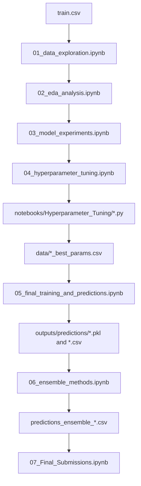

## Shell.ai Hackathon 2025: Fuel Blend Property Prediction

This repository contains a notebook-driven solution for the Shell.ai Hackathon challenge on sustainable fuel blend properties. The task is to predict 10 final blend properties from 55 input features describing blend composition and component properties.

The workflow in this repo is:
1. explore the data and identify useful patterns,
2. benchmark several regression models,
3. tune model hyperparameters,
4. train final models,
5. combine predictions with simple ensembles.

## Problem Summary

The core difficulty is that blend properties depend on both the proportions of each base component and the certificate-of-analysis properties of the individual component batches. The relationships are not purely linear, so the project tests tree-based models and ensembles rather than relying on a single baseline.

## Data Layout

The repository uses the competition `train.csv` and `test.csv` files stored under [data](/home/reu24mandaloju/projects/shell_ai_hack/data).

### Training data

`train.csv` contains 65 columns:

| Section | Count | Description |
|---|---:|---|
| Blend composition | 5 | `Component1` to `Component5` |
| Component properties | 50 | `Component{N}_Property{M}` for 5 components x 10 properties |
| Targets | 10 | `BlendProperty1` to `BlendProperty10` |

### Test data

`test.csv` contains 500 samples with the same 55 input features and no target columns.

### Target schema

The model predicts these 10 outputs:

`BlendProperty1`, `BlendProperty2`, `BlendProperty3`, `BlendProperty4`, `BlendProperty5`, `BlendProperty6`, `BlendProperty7`, `BlendProperty8`, `BlendProperty9`, `BlendProperty10`

## Evaluation

The competition metric is Mean Absolute Percentage Error (MAPE):

```text
MAPE = (100 / n) * sum(|(actual - predicted) / actual|)
```

Lower is better.

## Repository Workflow

The work in this repository is organized as a notebook-first pipeline:


```mermaid
graph TD
    A[train.csv] --> B[01_data_exploration.ipynb]
    B --> C[02_eda_analysis.ipynb]
    C --> D[03_model_experiments.ipynb]
    D --> E[04_hyperparameter_tuning.ipynb]
    E --> F[notebooks/Hyperparameter_Tuning/*.py]
    F --> G[data/*_best_params.csv]
    G --> H[05_final_training_and_predictions.ipynb]
    H --> I[outputs/predictions/*.pkl and *.csv]
    I --> J[06_ensemble_methods.ipynb]
    J --> K[predictions_ensemble_*.csv]
    K --> L[07_Final_Submissions.ipynb]
```

### What each stage does

- `01_data_exploration.ipynb` and `02_eda_analysis.ipynb` focus on data inspection, missingness, feature behavior, and early feature importance observations.
- `03_model_experiments.ipynb` benchmarks candidate regressors.
- `04_hyperparameter_tuning.ipynb` coordinates the tuning process and summarizes the tuned runs.
- `notebooks/Hyperparameter_Tuning/*.py` contains runnable tuning scripts for CatBoost, Gradient Boosting, LightGBM, Random Forest, and XGBoost.
- `05_final_training_and_predictions.ipynb` trains the selected models and generates prediction files.
- `06_ensemble_methods.ipynb` combines model outputs with averaging and median-based ensembles.
- `07_Final_Submissions.ipynb` is kept as a final submission workspace.

## Generated Artifacts

This repository includes generated files that document intermediate and final results:

### Tuned parameters in [data](/home/reu24mandaloju/projects/shell_ai_hack/data)

- `catboost_best_params.csv`
- `gb_best_params.csv`
- `lightgbm_best_params.csv`
- `rf_best_params.csv`
- `xgb_best_params.csv`

### Logs in [logs](/home/reu24mandaloju/projects/shell_ai_hack/logs)

- `catboost_tuning.log`
- `gb_tuning.log`
- `lightgbm_tuning.log`
- `randomforest_tuning.log`
- `xgb_tuning.log`

### Final model and prediction artifacts in [outputs/predictions](/home/reu24mandaloju/projects/shell_ai_hack/outputs/predictions)

- `models_catboost.pkl`
- `models_gradient_boosting.pkl`
- `models_xgboost.pkl`
- `predictions_catboost.csv`
- `predictions_gradient_boosting.csv`
- `predictions_xgboost.csv`
- `predictions_ensemble_simple_avg.csv`
- `predictions_ensemble_weighted_avg.csv`
- `predictions_ensemble_median.csv`
- `predictions_final_median.csv`

## Setup and Reproducibility

This repo does not currently include a top-level dependency manifest in the project folder, so the environment has to be reconstructed from the notebook imports and the tuning scripts.

Notes before rerunning the pipeline:

- Several notebooks use absolute local paths, so those paths may need to be updated before rerunning outside the original machine.
- The workflow is notebook-first, so rerunning the project means executing the notebooks in order rather than a single top-level training script.
- The tuning scripts under `notebooks/Hyperparameter_Tuning` are the closest thing to a scriptable entry point for model search.

## Repository Structure

```text
shell_ai_hack/
├── README.md
├── LICENSE
├── data/
│   ├── catboost_best_params.csv
│   ├── gb_best_params.csv
│   ├── lightgbm_best_params.csv
│   ├── rf_best_params.csv
│   ├── test.csv
│   ├── train.csv
│   └── xgb_best_params.csv
├── logs/
│   ├── catboost_tuning.log
│   ├── gb_tuning.log
│   ├── lightgbm_tuning.log
│   ├── randomforest_tuning.log
│   └── xgb_tuning.log
├── notebooks/
│   ├── 01_data_exploration.ipynb
│   ├── 02_eda_analysis.ipynb
│   ├── 03_model_experiments.ipynb
│   ├── 04_hyperparameter_tuning.ipynb
│   ├── 04_tuning_results.ipynb
│   ├── 05_final_training_and_predictions.ipynb
│   ├── 06_ensemble_methods.ipynb
│   ├── 07_Final_Submissions.ipynb
│   └── Hyperparameter_Tuning/
│       ├── catboost_tuning.py
│       ├── gradient_boosting_tuning.py
│       ├── lightgbm_tuning.py
│       ├── random_forests_tuning.py
│       └── xgboost_tuning.py
└── outputs/
    └── predictions/
        ├── models_catboost.pkl
        ├── models_gradient_boosting.pkl
        ├── models_xgboost.pkl
        ├── predictions_catboost.csv
        ├── predictions_ensemble_median.csv
        ├── predictions_ensemble_simple_avg.csv
        ├── predictions_ensemble_weighted_avg.csv
        ├── predictions_final_median.csv
        ├── predictions_gradient_boosting.csv
        └── predictions_xgboost.csv
```

## Key Takeaways

- The solution is centered on tree-based regression rather than a single linear baseline.
- Feature behavior is driven more by component fractions than by raw component-property fields alone.
- The repo is useful both as a competition submission archive and as a worked example of notebook-based model development.

## Acknowledgments

- Shell.ai for the challenge prompt and dataset.
- HackerEarth for hosting the competition.
- The open-source Python data science ecosystem used throughout the notebooks.